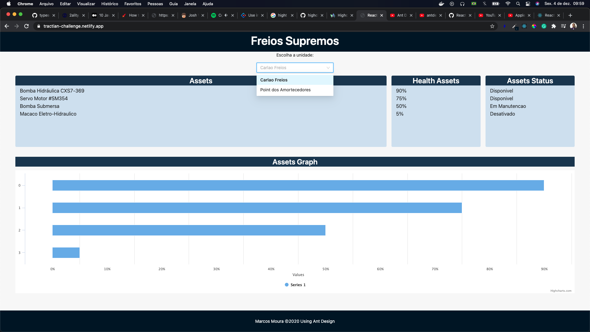

# Challenge for Job Application

This is a code test for a job application. The such company is [Tractian](https://tractian.com). As they itself define their mission:
<h1 align='center'>
  
</h1>

```
Nossa missão é transformar a experiência de quem trabalha em manutenção. O que interessa é suas máquinas não te deixarem na mão e fazer tudo funcionar como deve funcionar. Queremos que todos os profissionais de manutenção tenham acesso ao monitoramento online de equipamentos e a uma plataforma completa que consiga analisar, fornecer insights valiosos e permitir tomada de decisões de um jeito muito mais prático e intuitivo.
```

# Challenge Purpose

This challenge has such purpose to test the applicant's skills for an open position.

# The Challenge

The code challenge consists in to build a nodejs backend to work with a reactjs front end, and host both online. Below are some tools/frameworks/libs used to achieve this result:
```
ReactJs - javascript based frontend framework;
NodeJS - javascript backend runtime;
Heroku - online deploy for apps;
Docker - container for apps;
MongoDB - NoSQL database;
MongoDB Atlas - on line deploy for mongo databases;
Heroku Kaffeine - makes Heroku app stand wake over time;
AntDesign - A design system for enterprise-level products;
Netlify - Online deploy for front-end apps;
Sucrase - development environment;
Nodemon - development environment;
ExpressJS;
Axios;
CORS;
Mongoose;
Multer.
```

# Live Demos

## Backend
[Heroku](https://challenge-tractian.herokuapp.com/)

## Frontend
[Netlify](https://tractian-challenge.netlify.app/)
<h1 align='center'>
  
</h1>

# Repository

[github](https://github.com/thomaslnx/TractianChallenge)

# Where to find me
[Linkedin](https://www.linkedin.com/in/marcos-de-moura-silva/)
<br>
[Github](https://github.com/thomaslnx)
<br>
[Twitter](https://twitter.com/thomaslnx)